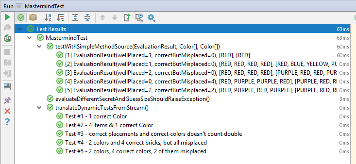

# MastermindKata

The Test-Class [MastermindTest.kt](src/test/kotlin/org/swk/mastermind/MastermindTest.kt) contains

- one [parameterized test](http://junit.org/junit5/docs/current/user-guide/#writing-tests-parameterized-tests)
- one [dynamic test](http://junit.org/junit5/docs/current/user-guide/#writing-tests-dynamic-tests)

Both checking the same test-cases. It's meant as a comparison to readability of test and test-results (keeping in mind, that kotlin is used instead of java). Overall I do like the individual naming of testcases in dynamic tests, making failing testcases more comprehensive especially on CI-Servers:



## Parameterized Test

**drawbacks**: 

- It does need one static factory-method. So in Kotlin a `companion object` needs to be defined and the `@JvmStatic`-Annotation is needed
- the output is somewhat cryptic, using `toString()`

**pro**: 

- the test cases are well readable (or at least, it could be worse)

```
companion object {
    @JvmStatic
    fun secretAndGuessProvider() = Stream.of(
        // TestCase 1
        Arguments.of( EvaluationResult(1,0),
                arrayOf(RED),
                arrayOf(RED) ),

        // TestCase 2
        Arguments.of( EvaluationResult(1,0),
                arrayOf(RED, RED, RED, RED),
                arrayOf(RED, BLUE, YELLOW, PURPLE) ) 
        // ... etc.
    )
}


@ParameterizedTest
@MethodSource("secretAndGuessProvider")
fun testWithSimpleMethodSource(expected: EvaluationResult, 
	secret : Array<Mastermind.Color>, 
	guess : Array<Mastermind.Color>) {
    assertEquals(expected, Mastermind(*secret).evaluate(*guess))
}

```

## Dynamic Tests
**drawbacks**: 

- Readability is a bit less nice due to the lambda. Probably it could be improved by calling an extra method executing the testcase.
- no `@Before`, `@After`, etc. possible

**pro**: individual naming of the testcase

```
@TestFactory
fun translateDynamicTestsFromStream() = Arrays.asList(
        DynamicTest.dynamicTest(
                "Test #1 - 1 correct Color",
                { assertEquals(
                        EvaluationResult(1,0),
                        Mastermind(RED).evaluate(RED))
                }),
        DynamicTest.dynamicTest(
                "Test #2 - 4 Items & 1 correct Color",
                { assertEquals(
                        EvaluationResult(1,0),
                        Mastermind(RED, RED, RED, RED).evaluate(RED, BLUE, YELLOW, PURPLE))
                })
)
```


